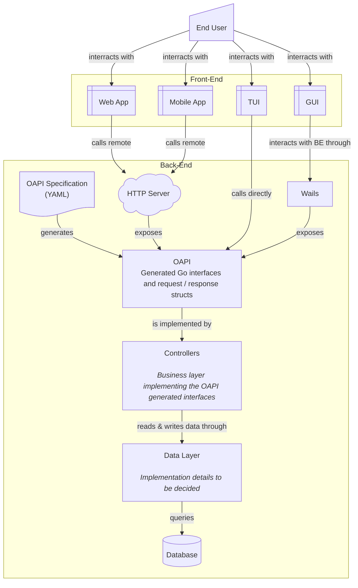

# Architecture

## Front-Facing Parts

This diagram explains an approach allowing all user facing interfaces to funnel down to a single interface that can easily be exposed either directly (direct calls in _Go_ code or through the _Wails_ FE/BE channel) or remotely (API exposed by a HTTP server).

