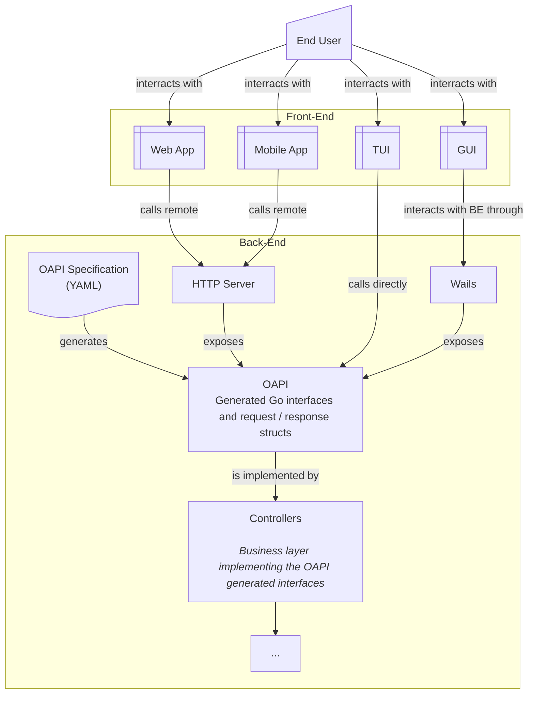
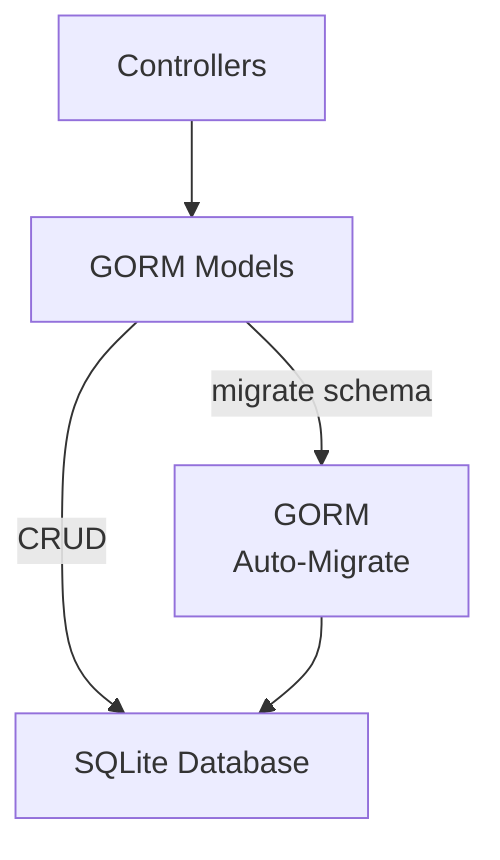

# Architecture

## Front-Facing Parts

This diagram explains an approach allowing all user facing interfaces to funnel down to a single interface that can easily be exposed either directly (direct calls in _Go_ code or through the _Wails_ FE/BE channel) or remotely (API exposed by a HTTP server).

## Data Layout

This describes the early stages of the development. It might (will most probably) change in the future for a more "industrial" way.

### Overview

### Access

For the MVP / prototyping phase, the data access will be done using the [GORM](https://gorm.io/) Object-Relational framework. Controllers may use those models directly ([Rails](https://rubyonrails.org/)-style) in order to simplify development at first. However, more complex logic will be defined in the `models` package, in order to make them testable and re-usable.

### Schema Migration

When the software reaches a near stable _Version 1_ state, migrations will be done in manual SQL to ensure that any needed data manipulation is perform properly and without some automatic decision from any other library.

Until then, however, data migrations will be done automatically by [GORM](#access), in order to allow rapid development in the MVP phase.
